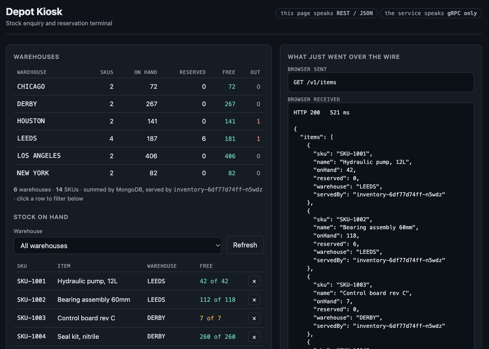
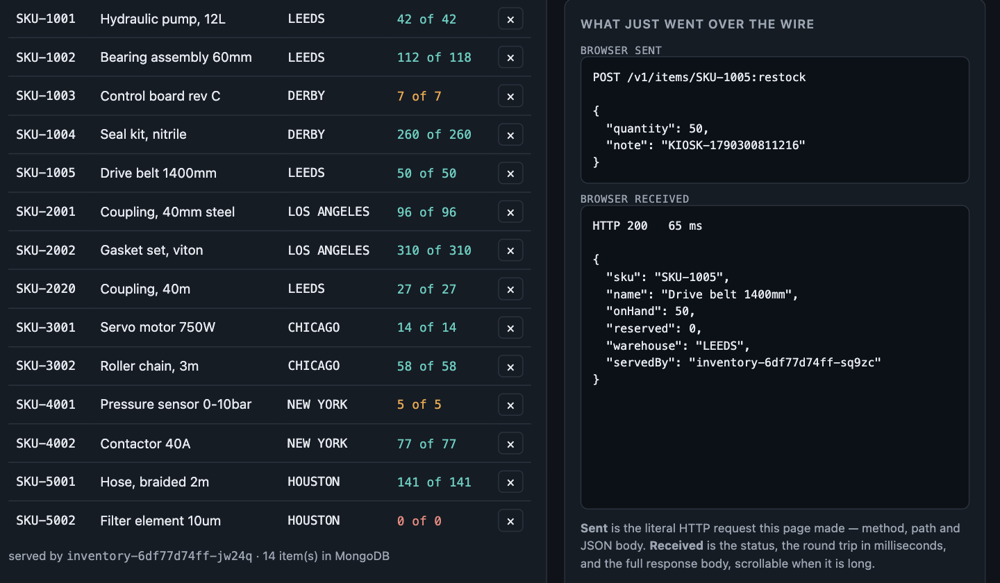
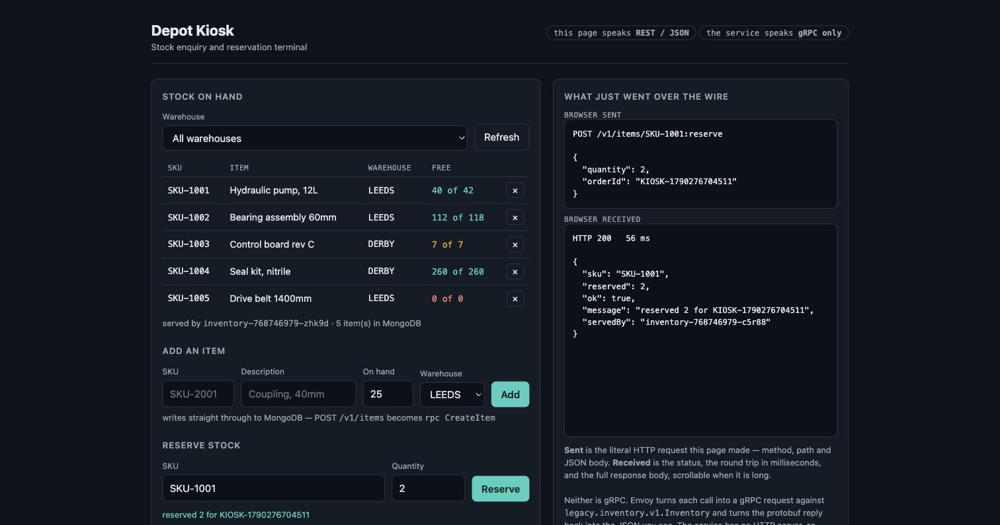
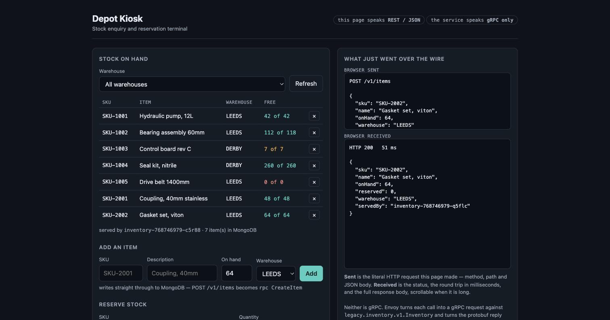
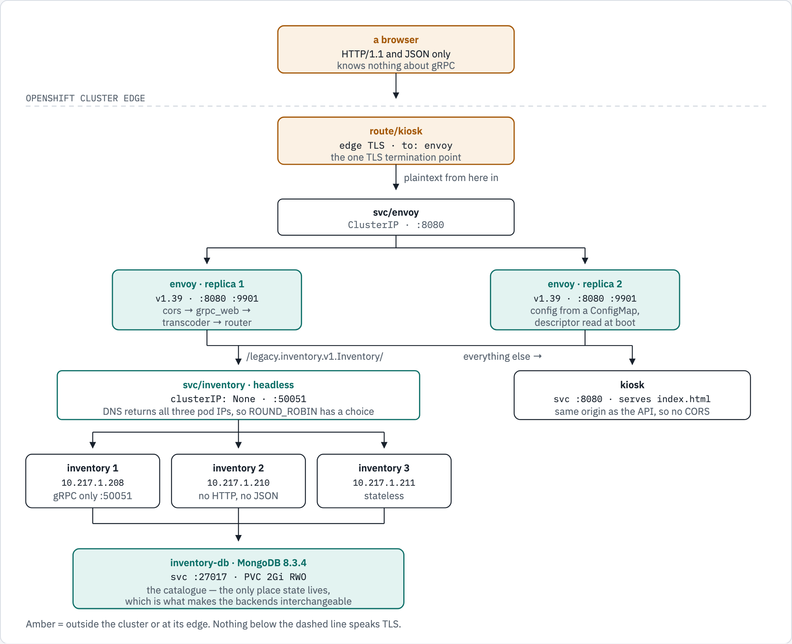
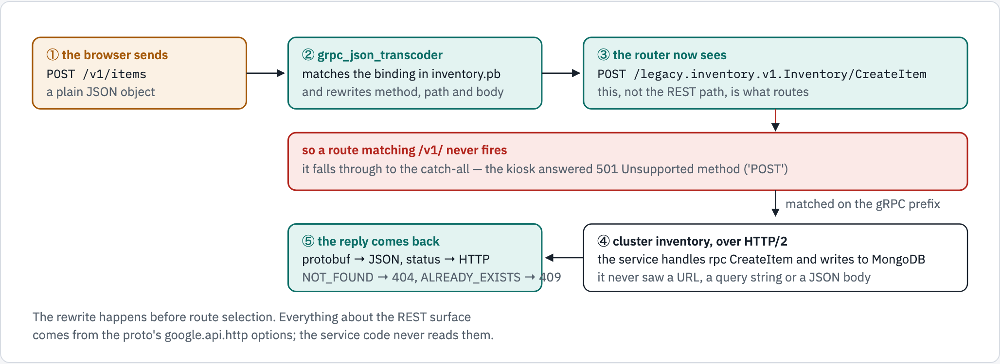
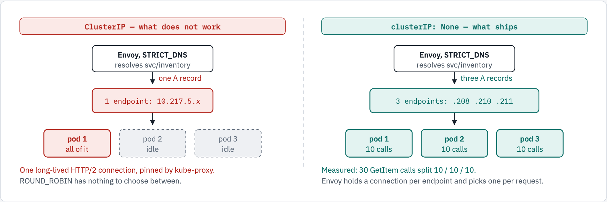

# Modernising a gRPC-only service with Envoy

> Extracted from the `mongodb-poc` repository so the demo stands on its own.
> Runs on OpenShift Local (CRC); nothing is built or pushed.

A service that speaks **gRPC and nothing else** — no HTTP server, no JSON, no CORS — made
reachable from a browser, **without changing a line of it**. Envoy sits in front as its own
Deployment and synthesises the modern interface from the service's own `.proto`.

This is the same shape as the `mongot` deployment in this repository: Envoy as a separate
Deployment rather than a sidecar. The difference is that this one is yours — you choose the
version and the filter chain, rather than the operator choosing for you.

```text
  +--------------------------------------------------------------+
  | kiosk  -  a browser page                                      |
  | speaks HTTP/1.1 and JSON only                                 |
  | GET /v1/items   POST /v1/items   DELETE /v1/items/{sku}       |
  +--------------------------------------------------------------+
                                  |
                                  v
  +--------------------------------------------------------------+
  | Envoy x2  -  its own Deployment, config from a ConfigMap      |   <-- you own this
  | cors -> grpc_web -> grpc_json_transcoder -> router            |
  | reads inventory.pb and builds the REST surface from it        |
  +--------------------------------------------------------------+
                                  |
                 round robin over three endpoints
                                  |
            +---------------------+---------------------+
            v                     v                     v
  +------------------+  +------------------+  +------------------+
  | inventory-0      |  | inventory-1      |  | inventory-2      |
  | gRPC only, :50051 - no HTTP server, no JSON, no CORS         |
  +------------------+  +------------------+  +------------------+
            |                     |                     |
            +---------------------+---------------------+
                                  |
                                  v
  +--------------------------------------------------------------+
  | inventory-db  -  MongoDB on a PVC                             |
  | the catalogue, so the backends are stateless and replaceable  |
  +--------------------------------------------------------------+
```

Four layers, each its own Deployment. The backends hold no state, so any of the three can
answer any call — every reply carries `servedBy`, naming the pod that produced it.

## What it proves



The badges are the whole point: the page speaks REST/JSON, the service speaks gRPC only, and
the right-hand panel shows exactly what crossed the wire. The warehouse summary above the
table is computed by a MongoDB aggregation, not by counting rows in the service —
`6 warehouses · 14 SKUs · summed by MongoDB, served by inventory-6df77d74ff-n5wdz`. Clicking
a warehouse row filters the stock table below it.

Restocking an out-of-stock item is its own verb, because `CreateItem` correctly refuses a
SKU that already exists:



`POST /v1/items/SKU-1005:restock` with `{"quantity": 50}` — and SKU-1005 goes from `0 of 0`
to `50 of 50`. It uses `$inc`, not `$set`, so two deliveries arriving at once both count.

Reserving stock mutates real state, through Envoy, in MongoDB:



The panel shows `POST /v1/items/SKU-1001:reserve` with its JSON body, the 200 that came back
in 56 ms, and `"reserved": 2` — and SKU-1001 goes from 42 free to 40.

Writing new data works the same way, which is the point of the database layer:



The browser sent `POST /v1/items` with a plain JSON object. Envoy turned it into
`rpc CreateItem`, the service wrote it to MongoDB, and the row appears in the table — now
`7 item(s) in MongoDB`. Note that the item was written by `inventory-768746979-q5flc` while
the list that follows was served by `-c5r88`: different pods, same data, because the state is
in the database rather than in a process.

## The labs

The base demo is the three layers plus a database. Two labs build on it, and
each one is self-contained and verified end to end on a live cluster.

| Lab | What it adds | Doc |
|---|---|---|
| base | REST → gRPC transcoding, a kiosk, MongoDB, 3 replicas | this file |
| 01 | Prometheus metrics on both tiers, ServiceMonitors, alerting rules, a load runner, measured performance | [labs/01-metrics](labs/01-metrics/README.md) |
| 02 | Red Hat Custom Metrics Autoscaler, an HPA driven by request rate | [labs/02-autoscaling](labs/02-autoscaling/README.md) |

One item followed from a browser form all the way to its MongoDB document is in
[docs/DATA-PATH.md](docs/DATA-PATH.md).

Headline numbers, measured rather than estimated:

```text
lab 01   73,989 requests in 60s = 1,233 req/s, 0 errors
         p50 8.9 ms   p99 59 ms end to end   p99 17.6 ms in the handler
         load split 33.3% / 33.3% / 33.3% across three replicas

lab 02   202.3 rps per pod against an 80 rps target -> scaled 3 -> 10 pods
```

## Architecture



Four Deployments: the kiosk page, two Envoy replicas, three stateless gRPC
backends behind a headless Service, and MongoDB on a persistent volume. The
Route is the only TLS termination.



The transcoder rewrites the request *before* the router picks a route, which is
why the route table matches the gRPC path.



Same three pods, same `ROUND_ROBIN`; the only difference is what DNS returns.

The diagram source is `docs/diagrams/modernize-architecture/source.html`.
Re-render with:

```bash
# needs Playwright's Chromium:
#   python3 -m pip install playwright && python3 -m playwright install chromium
python3 docs/diagrams/render.py \
  docs/diagrams/modernize-architecture/source.html \
  docs/diagrams/modernize-architecture layers,request,headless
```

`render.py` renders every `.fig-scroll` in the page to a light and a dark PNG
at 2x, reports page errors, and fails if the page scrolls sideways at 375 px.

## Run it

```bash
./demo.sh deploy     # namespace, ConfigMaps, four Deployments, the Route
./demo.sh test       # exercise every endpoint through Envoy
./demo.sh metrics    # Envoy request counters from the admin endpoint
./demo.sh url        # print the kiosk URL
./demo.sh clean      # delete the namespace
```

`deploy` generates the database password into `secret/inventory-db` on first run and leaves
it alone afterwards, so nothing secret is committed and redeploying does not lock the
running database out of its own data.

Measured on CRC 4.22:

```text
GET  /v1/items                      -> ListItems     200, five items
GET  /v1/items/SKU-1003             -> GetItem       200, path parameter bound to sku
GET  /v1/items?warehouse=DERBY      -> ListItems     200, query parameter bound to warehouse
POST /v1/items/SKU-1001:reserve     -> ReserveStock  200, JSON body bound to the message
POST /v1/items                      -> CreateItem    200, item written to MongoDB
POST /v1/items  (same sku again)    -> CreateItem    409, from gRPC ALREADY_EXISTS
DELETE /v1/items/{sku}              -> DeleteItem    200
GET  /v1/items/NOPE                 -> GetItem       404, from gRPC NOT_FOUND

what the service logged:
  ListItems warehouse='' page_size=0
  GetItem sku=SKU-1003
  ListItems warehouse='DERBY' page_size=0
  ReserveStock sku=SKU-1001 qty=5 order=CURL-001
  CreateItem sku=SKU-T6460
  DeleteItem sku=SKU-T6460
  GetItem sku=NOPE
```

Only gRPC method calls. The service never saw a URL, a query string or a JSON body.

## How the REST surface is defined

Entirely in the proto. The service code never reads these annotations — Envoy does:

```protobuf
service Inventory {
  rpc GetItem (GetItemRequest) returns (Item) {
    option (google.api.http) = { get: "/v1/items/{sku}" };
  }
  rpc ReserveStock (ReserveStockRequest) returns (ReserveStockResponse) {
    option (google.api.http) = { post: "/v1/items/{sku}:reserve" body: "*" };
  }
  rpc CreateItem (CreateItemRequest) returns (Item) {
    option (google.api.http) = { post: "/v1/items" body: "item" };
  }
  rpc DeleteItem (DeleteItemRequest) returns (DeleteItemResponse) {
    option (google.api.http) = { delete: "/v1/items/{sku}" };
  }
}
```

Two POSTs coexist because the suffix after the colon distinguishes them: `/v1/items` is
create, `/v1/items/{sku}:reserve` is the reserve verb. `body: "item"` binds the request body
to that one field, so the JSON on the wire is the bare item object rather than
`{"item": {...}}`.

Envoy needs these compiled into a descriptor set, which is what it actually reads:

```bash
python -m grpc_tools.protoc -Iproto \
  --include_imports --include_source_info \
  --descriptor_set_out=proto/inventory.pb \
  --python_out=app --grpc_python_out=app \
  proto/inventory.proto
```

`--include_imports` is not optional: without it the descriptor lacks
`google/api/annotations.proto` and Envoy rejects the config.

## Six things that will catch you

**Route on the gRPC path, not the REST path.** `grpc_json_transcoder` rewrites the request
*before* the router picks a route. `GET /v1/items` becomes
`POST /legacy.inventory.v1.Inventory/ListItems`, so a route matching `/v1/` never fires. The
first version of this demo routed everything to the kiosk and returned
`501 Unsupported method ('POST')` from a Python static file server — which is a confusing way
to discover it. Match `/legacy.inventory.v1.Inventory/` instead.

**The upstream cluster must be HTTP/2.** gRPC is HTTP/2. Leave
`http2_protocol_options` off the cluster and Envoy speaks HTTP/1.1 upstream and every call
fails.

**pip cannot write `/.local` on OpenShift.** Containers run with a random UID and no writable
home, so a plain `pip install` fails with `Permission denied: '/.local'`. Install with
`--target` into an `emptyDir` and put it on `PYTHONPATH`.

**A ClusterIP Service defeats the load balancing you just configured.** `STRICT_DNS`
resolves the name it is given; a ClusterIP Service resolves to one virtual IP, so Envoy sees
a single endpoint, `ROUND_ROBIN` has nothing to choose between, and kube-proxy pins the one
long-lived HTTP/2 connection to a single pod. `clusterIP: None` makes DNS return every pod
IP. Measured here: with the headless Service, 30 calls split exactly 10 / 10 / 10 across the
three replicas.

Converting an existing Service is not an in-place edit — `spec.clusterIP` is immutable and
apply fails with `spec.clusterIPs[0]: Invalid value: ["None"]: may not change once set`. The
Service has to be deleted and recreated, which `demo.sh` does for you.

**A `+` in a query value is not a space.** The transcoder decodes percent-escapes, so
`?warehouse=NEW%20YORK` binds `"NEW YORK"` and matches. It does not treat `+` as a space —
`?warehouse=NEW+YORK` binds the literal `"NEW+YORK"` and matches nothing. That is correct per
RFC 3986, where `+` means a space only in `application/x-www-form-urlencoded` bodies, but it
differs from many web frameworks. The kiosk uses `encodeURIComponent`, which emits `%20`;
`curl --data-urlencode` emits `+`, which is how this was found.

**Envoy reads the proto descriptor once, at startup.** Updating the `envoy-proto` ConfigMap
changes the file on disk but not the running proxy, and `oc apply` on the Deployment does not
restart pods when only a ConfigMap changed. Symptoms are specific and misleading: new RPCs
return `upstream connect error ... remote reset` or 503, and new response fields are silently
dropped from the JSON. `demo.sh deploy` restarts all three Deployments for this reason.

## What Envoy adds here, and what it does not

| Added by Envoy | How |
|---|---|
| REST + JSON | `grpc_json_transcoder`, driven by the proto's `google.api.http` options |
| Browser access | `grpc_web`, for clients that want gRPC-Web rather than REST |
| CORS | `cors` filter, needed only if the page is served from another origin |
| Load balancing | `STRICT_DNS` + `ROUND_ROBIN` across backend replicas, via a headless Service |
| One TLS edge | the OpenShift Route terminates; the backend stays plaintext inside the cluster |
| Metrics | its own `/stats/prometheus`, scraped by the ServiceMonitor in `50-metrics.yaml` |

It does **not** add authentication, rate limiting or observability to your service by magic —
those are further filters you would choose deliberately. And it cannot invent an API: the REST
surface exists only because the proto describes it.

## Scaling and metrics

The backend runs three replicas. Because state is in MongoDB rather than in the process, the
replicas are interchangeable and Envoy spreads calls across them:

```console
$ for i in $(seq 1 30); do curl -sk "https://$H/v1/items/SKU-1001"; done \
    | grep -o '"servedBy": "[^"]*"' | sort | uniq -c
  10 "servedBy": "inventory-768746979-76f5z"
  10 "servedBy": "inventory-768746979-hxm7d"
  10 "servedBy": "inventory-768746979-vr8h5"
```

`GetItem` returns a single item, so that is one `servedBy` per call. Use `ListItems` and each
item carries one too, which inflates the counts.

Envoy publishes its own view on the admin endpoint, which `manifests/50-metrics.yaml` exposes
as `svc/envoy-stats` and a ServiceMonitor:

```console
$ ./demo.sh metrics
  envoy_cluster_membership_healthy{envoy_cluster_name="inventory"} 3
  envoy_cluster_upstream_rq_total{envoy_cluster_name="inventory"} 18
```

`membership_healthy = 3` is the headless Service working — that is Envoy holding three
endpoints rather than one. The request counter is per Envoy pod, and Prometheus scrapes each
pod separately, so the two replicas' counters sum to the traffic sent: 40 calls appeared as
18 and 22.

The Envoy image carries no shell tooling — no `curl`, no `wget` — so `demo.sh metrics` scrapes
through the kiosk pod, which has `python3`.

Reservations are applied as one conditional update, so two replicas cannot oversell the same
item:

```python
self.items.find_one_and_update(
    {"sku": request.sku,
     "$expr": {"$gte": [{"$subtract": ["$on_hand", "$reserved"]}, request.quantity]}},
    {"$inc": {"reserved": request.quantity}},
    return_document=ReturnDocument.AFTER)
```

The filter and the increment are evaluated together by MongoDB. If the update matches nothing
the service reads the item back to say whether the sku was missing or the stock was short.

## Layout

| Path | What |
|---|---|
| `proto/inventory.proto` | the service contract, including the HTTP mapping |
| `proto/inventory.pb` | compiled descriptor set, what Envoy actually reads |
| `app/server.py` | the gRPC-only service |
| `kiosk/index.html` | the browser front end, REST and JSON only |
| `manifests/05-database.yaml` | layer 0, MongoDB and its PVC |
| `manifests/10-inventory.yaml` | layer 1, the backend, three replicas behind a headless Service |
| `manifests/20-envoy-config.yaml` | Envoy's whole configuration |
| `manifests/30-envoy.yaml` | layer 2, Envoy as its own Deployment |
| `manifests/40-kiosk.yaml` | layer 3, the kiosk, and the Route |
| `manifests/50-metrics.yaml` | Envoy stats Service and both ServiceMonitors |
| `manifests/60-alerts.yaml` | recording rules and alerts (evaluated by Thanos Ruler) |
| `loadgen/load.py` | the load runner used in both labs |
| `labs/01-metrics/` | metrics lab: ServiceMonitors, measurements |
| `labs/02-autoscaling/` | autoscaling lab: operator, ScaledObject, RBAC |
| `docs/DATA-PATH.md` | one item, browser form to MongoDB document |
| `docs/diagrams/` | the architecture figures and their source |
| `demo.sh` | deploy, test, metrics, url, clean |

Nothing is built or pushed: all three images (`python:3.12-slim`,
`envoyproxy/envoy:v1.39-latest`, `mongodb/mongodb-community-server:8.3.4-ubi9`) are public,
and all source ships in ConfigMaps — the same pattern as the search GUI in the parent
repository.
