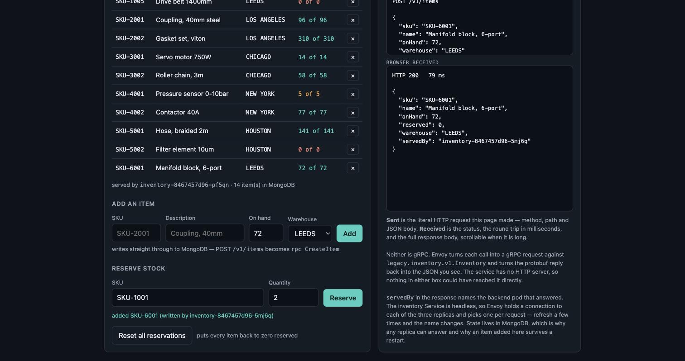

# From a kiosk form to a MongoDB document

One item, followed the whole way, on a live cluster.

## 1 — typed into the browser



The page sent a plain JSON object. No gRPC, no protobuf, nothing the browser
would need a library for:

```http
POST /v1/items
{
  "sku": "SKU-6001",
  "name": "Manifold block, 6-port",
  "onHand": 72,
  "warehouse": "LEEDS"
}
```

## 2 — what came back

```json
HTTP 200   79 ms
{
  "sku": "SKU-6001",
  "name": "Manifold block, 6-port",
  "onHand": 72,
  "reserved": 0,
  "warehouse": "LEEDS",
  "servedBy": "inventory-8467457d96-5mj6q"
}
```

`servedBy` names the pod that handled it. The kiosk footer then read
`14 item(s) in MongoDB` — one more than the seeded 13.

## 3 — what Envoy turned it into

The service has no HTTP server, so it never saw that request. Envoy rewrote it
using the binding in `proto/inventory.proto`:

```protobuf
rpc CreateItem (CreateItemRequest) returns (Item) {
  option (google.api.http) = { post: "/v1/items" body: "item" };
}
```

into `POST /legacy.inventory.v1.Inventory/CreateItem` over HTTP/2, and the
service logged a method call, not a URL:

```text
CreateItem sku=SKU-6001
```

## 4 — the document, read straight from MongoDB

```console
$ oc exec -n modernize-demo deploy/inventory-db -- mongosh --quiet \
    -u "$U" -p "$P" --authenticationDatabase admin inventory \
    --eval 'JSON.stringify(db.items.findOne({sku:"SKU-6001"}), null, 2)'
{
  "_id": "6ab57c5210963d38c10a83a0",
  "sku": "SKU-6001",
  "name": "Manifold block, 6-port",
  "on_hand": 72,
  "reserved": 0,
  "warehouse": "LEEDS"
}
```

Note `on_hand` in the database against `onHand` on the wire: the proto field is
`on_hand`, and the JSON transcoder applies the protobuf default of lowerCamelCase
on the wire. The service stores the proto's own spelling.

## The whole collection

```console
$ mongosh ... --eval 'db.items.find({}, {_id:0}).sort({sku:1})'
count: 14
  SKU-1001  Hydraulic pump, 12L       LEEDS           42
  SKU-1002  Bearing assembly 60mm     LEEDS          118
  SKU-1003  Control board rev C       DERBY            7
  SKU-1004  Seal kit, nitrile         DERBY          260
  SKU-1005  Drive belt 1400mm         LEEDS            0
  SKU-2001  Coupling, 40mm steel      LOS ANGELES     96
  SKU-2002  Gasket set, viton         LOS ANGELES    310
  SKU-3001  Servo motor 750W          CHICAGO         14
  SKU-3002  Roller chain, 3m          CHICAGO         58
  SKU-4001  Pressure sensor 0-10bar   NEW YORK         5
  SKU-4002  Contactor 40A             NEW YORK        77
  SKU-5001  Hose, braided 2m          HOUSTON        141
  SKU-5002  Filter element 10um       HOUSTON          0
  SKU-6001  Manifold block, 6-port    LEEDS           72   <- added from the kiosk
```

Thirteen seeded items across six warehouses, plus the one entered by hand.

## Why the database matters for the rest of the demo

Because the catalogue is here and not in a process, the backends are
interchangeable. That is what lets Envoy round-robin across them (33.3% each,
lab 01) and what lets the autoscaler add seven more pods mid-run without any of
them being wrong (lab 02). Proved by deleting every backend pod at once:

```console
$ oc delete pod -n modernize-demo -l app=inventory
$ curl -sk "https://$H/v1/items/SKU-9099"
{ "sku": "SKU-9099", ..., "servedBy": "inventory-768746979-q5flc" }
```

A brand-new pod, the same data.
