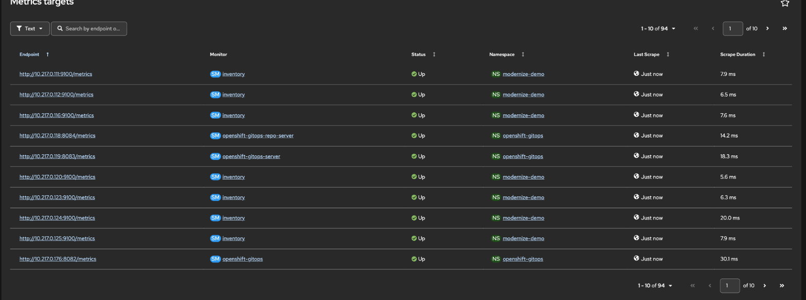
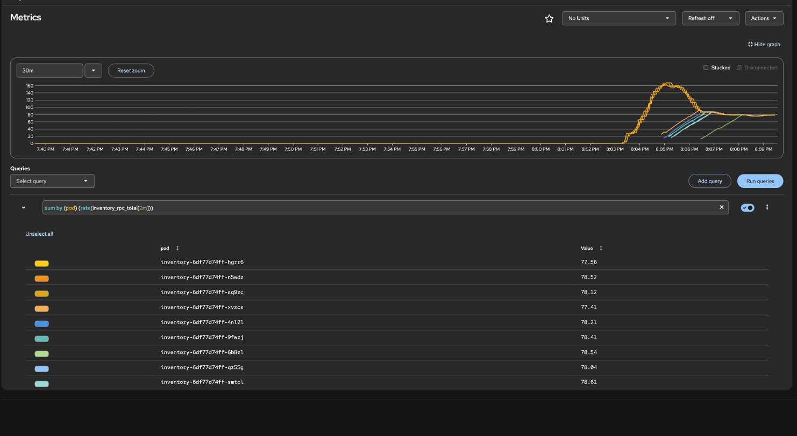
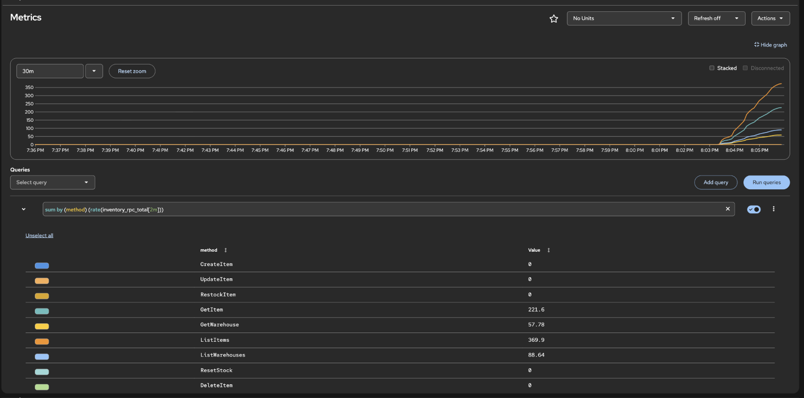
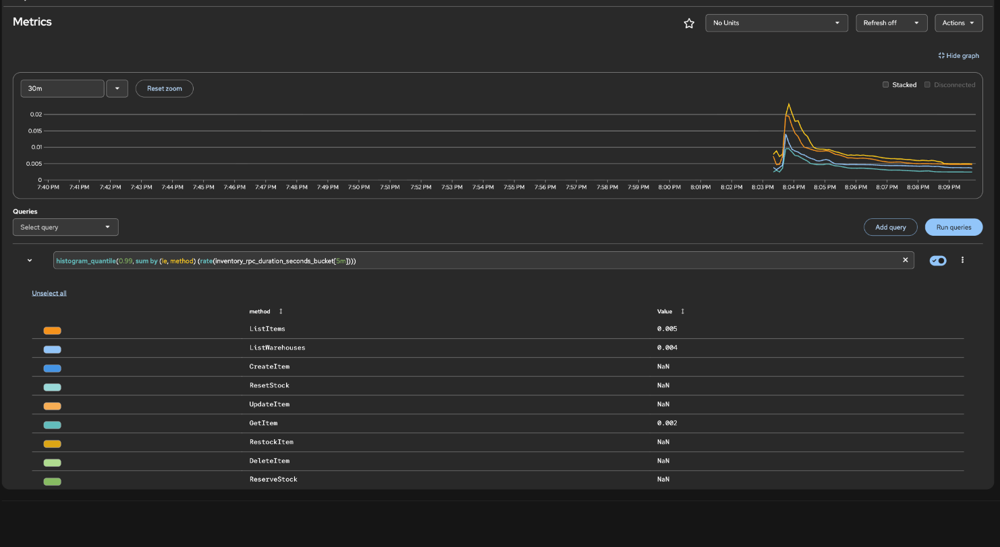
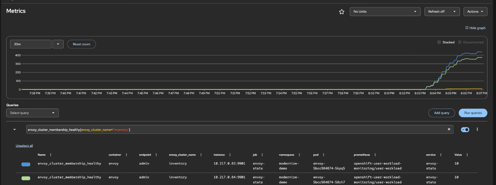
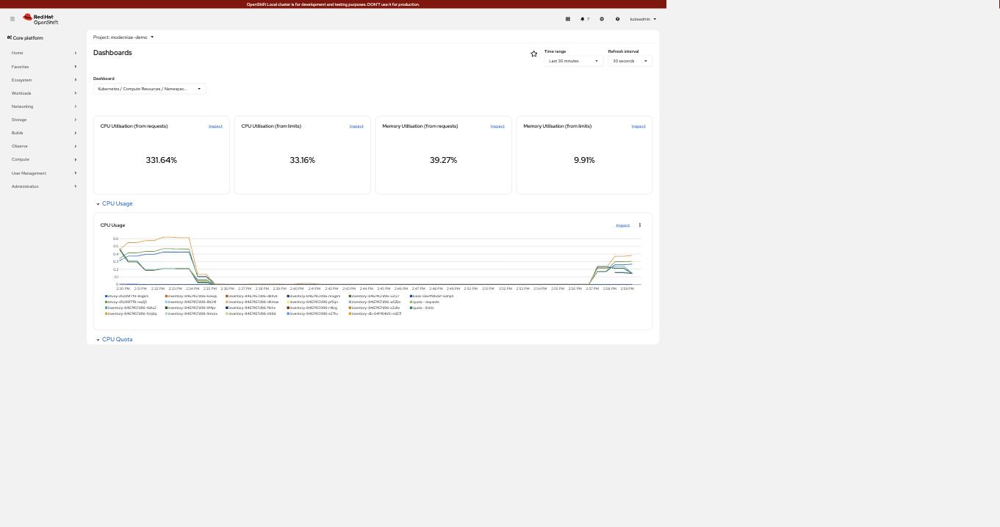
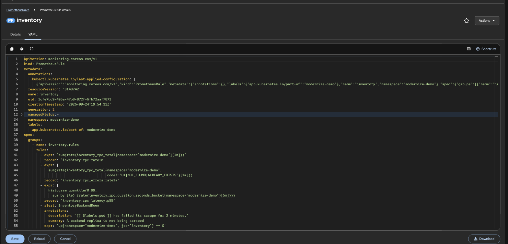

# Lab 01 — metrics, and what the numbers actually say

Both tiers publish Prometheus metrics, OpenShift scrapes them, and a load runner
produces numbers you can check against each other.

## What gets exposed

| Source | Endpoint | Exposed by |
|---|---|---|
| Envoy | `:9901/stats/prometheus` | `svc/envoy-stats` + `servicemonitor/envoy` |
| the service | `:9100/metrics` | `svc/inventory` (port `metrics`) + `servicemonitor/inventory` |

The application metrics come from one gRPC **interceptor**, not from per-method
instrumentation, so a new RPC is measured the moment it is added:

```python
RPC_TOTAL   = Counter("inventory_rpc_total", "gRPC calls handled", ["method", "code"])
RPC_SECONDS = Histogram("inventory_rpc_duration_seconds", "gRPC handler latency", ["method"])
INFLIGHT    = Gauge("inventory_rpc_inflight", "calls currently being handled")
ITEMS_TOTAL = Gauge("inventory_items_total", "documents in the catalogue")
```

`pod` is deliberately *not* a label — Prometheus attaches one per target already,
and duplicating it multiplies the series count for nothing.

## The trap in the interceptor

`context.abort()` raises a **bare `Exception`**, not a `grpc.RpcError`. Verified
on grpc-python before shipping:

```console
  caught_as        bare Exception
  code_in_finally  NOT_FOUND
  client_saw       NOT_FOUND
```

So the status is read from the context in a `finally` block. Catching
`grpc.RpcError` would label every `NOT_FOUND` and `ALREADY_EXISTS` as
`INTERNAL`, and the dashboard would report failures that never happened.
Measured after the fix — 5 lookups of a missing sku and 2 duplicate creates:

```text
inventory_rpc_total{code="NOT_FOUND",method="GetItem"}        3
inventory_rpc_total{code="NOT_FOUND",method="GetItem"}        1
inventory_rpc_total{code="NOT_FOUND",method="GetItem"}        1
inventory_rpc_total{code="ALREADY_EXISTS",method="CreateItem"} 2
```

## Run it

```bash
oc apply -f manifests/50-metrics.yaml
./demo.sh metrics                                   # counters straight off the admin port
python3 loadgen/load.py --url "https://$(oc get route kiosk -n modernize-demo \
  -o jsonpath='{.spec.host}')" --duration 60 --concurrency 16
```

User-workload monitoring must be on:

```bash
oc -n openshift-monitoring get cm cluster-monitoring-config \
  -o jsonpath='{.data.config\.yaml}'     # enableUserWorkload: true
```

## Measured — 60s, 16 workers, 3 backend replicas

```text
requests      73989 in 60.0s  =  1233.0 req/s
status        200=73989
latency ms    min 2.6  p50 8.9  p90 27.8  p99 59.0  max 116.2
served by
    inventory-8467457d96-4zhx2          24662  (33.3%)
    inventory-8467457d96-8b24l          24667  (33.3%)
    inventory-8467457d96-9f4pr          24660  (33.3%)
```

Three things worth noticing.

**The split is 33.3 / 33.3 / 33.3.** That is the headless Service plus Envoy's
`ROUND_ROBIN`, measured rather than assumed.

**The counters reconcile.** The service's own totals were 24662 + 24667 + 24660
= 73,989 — exactly what the load runner counted. If those two disagree, the
instrumentation is wrong, and this is the check that says so.

**Server time is not round-trip time.** The histogram put p99 handler latency at
**17.6 ms** while the client measured **59 ms** end to end. The difference is
queueing, TLS, the Route, and Envoy — which is the argument for measuring at
both ends rather than quoting one number.

## Checking it landed in Prometheus

```bash
TOKEN=$(oc create token metrics-reader -n modernize-demo --duration=60m)
THANOS=$(oc get route thanos-querier -n openshift-monitoring -o jsonpath='{.spec.host}')
curl -sk -H "Authorization: Bearer $TOKEN" \
  --data-urlencode 'query=sum(rate(inventory_rpc_total[5m]))' \
  "https://$THANOS/api/v1/query"
```

`oc whoami -t` returns nothing on CRC — the kubeconfig authenticates with client
certificates, not a bearer token, so a ServiceAccount token has to be minted.



Two Envoy targets and three inventory targets, all `Up`.



`sum by (pod) (rate(inventory_rpc_total[2m]))`. Captured mid-scale-out, which
makes the point better than a static shot would: the single high line is the
original replica set carrying everything, and the lines joining it are the seven
pods the autoscaler added. Once settled, all ten sit between **77.41 and 78.61
requests/second** — a spread of 1.5 %, which is Envoy's round-robin over the
headless Service.

### Broken down by gRPC method



`sum by (method) (rate(inventory_rpc_total[2m]))`. The interceptor labels every
call, so the read mix falls out without touching a handler: **ListItems 617.9/s,
GetItem 331.6/s**, and the write methods at zero because the load runner only
reads. The dip and recovery in the graph is a load run ending and another
starting.

### Latency, from the histogram



`histogram_quantile(0.99, …)` over `inventory_rpc_duration_seconds_bucket`:
**GetItem 2 ms, ListWarehouses 4 ms, ListItems 5 ms** at p99 in the handler.
The spike at the left is the scale-out — new pods are slowest on their first
requests, then settle. Methods with no traffic in
the window return `NaN` — correct, not a fault: there are no observations to
take a quantile of.

### The proxy tier



`envoy_cluster_upstream_rq_total` split by Envoy pod, alongside
`envoy_cluster_membership_healthy{envoy_cluster_name="inventory"}` = **10** on
both replicas. That second number is the headless Service seen from inside
Envoy: it holds one endpoint per backend pod, and it tracked the autoscaler from
3 to 10 without any configuration change.

### Namespace resources



Observe → Dashboards → *Kubernetes / Compute Resources / Namespace*. Worth
reading next to lab 02: CPU is at **33% of limits** while the service handles
about a thousand requests a second, which is the measurement that argues against
using CPU as the autoscaling signal.

## Alerting rules

`manifests/60-alerts.yaml` adds three recording rules and four alerts.



**Where to look for them.** On OpenShift, a `PrometheusRule` in a *user*
namespace is evaluated by **Thanos Ruler**, not by `prometheus-user-workload`.
Querying the prometheus-user-workload pod's `/api/v1/rules` shows nothing and it
is easy to conclude the rules never loaded. They had; they were somewhere else.

```bash
curl -sk -H "Authorization: Bearer $TOKEN" "https://$THANOS/api/v1/rules" \
  | python3 -c "import json,sys; [print(r['type'], r['name'], r['health'])
      for g in json.load(sys.stdin)['data']['groups'] if g['name']=='inventory.rules'
      for r in g['rules']]"
```
```text
recording inventory:rpc:rate1m
recording inventory:rpc_errors:rate1m
recording inventory:rpc_latency:p99
alerting  InventoryBackendDown
alerting  InventoryErrorRateHigh
alerting  InventoryLatencyHigh
alerting  InventoryAtMaxReplicas
```

Thanos Ruler reloads on a timer, so there is a lag of up to a minute between
`oc apply` and the rules appearing.

**What the error rule deliberately excludes.** `NOT_FOUND` and `ALREADY_EXISTS`
are the API telling a caller "no" — correct answers, not faults. Counting them
as errors would make the demo's own `404` and `409` tests page somebody:

```promql
sum(rate(inventory_rpc_total{code!~"OK|NOT_FOUND|ALREADY_EXISTS"}[1m]))
```

The latency threshold is set from the measured baseline rather than a round
number: p99 in the handler is about 18 ms, so the alert fires at 250 ms — an
order of magnitude worse, which means something genuinely changed.

## Note on `demo.sh metrics`

The Envoy image ships no shell tooling — no `curl`, no `wget` — so the scrape
runs from the kiosk pod, which has `python3`. Going through `svc/envoy-stats`
rather than a pod IP also proves the Service the ServiceMonitor depends on
resolves.

Counters are **per Envoy pod** and Prometheus scrapes each separately: 40 calls
appeared as 18 and 22, summing to 40.
