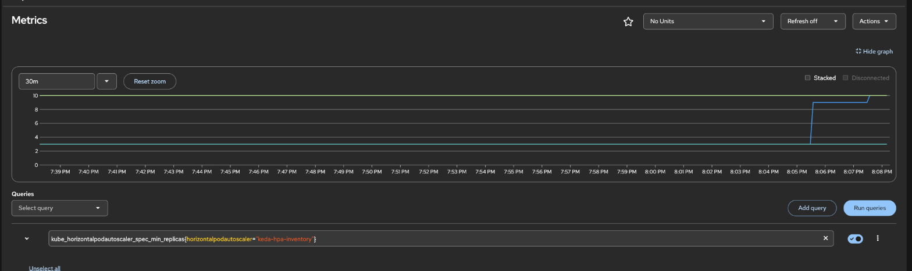
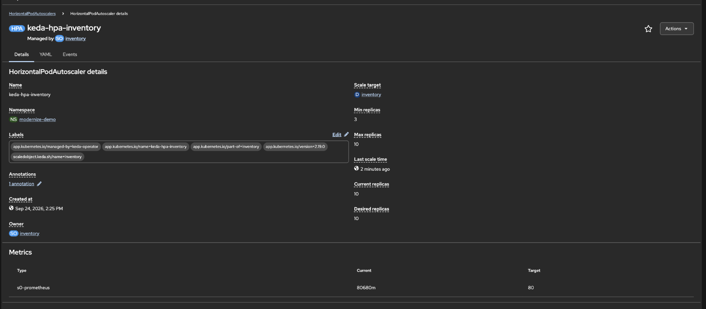
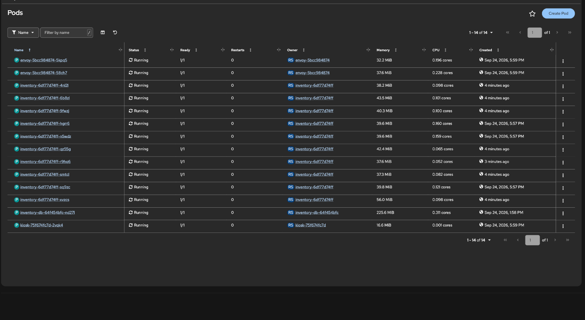
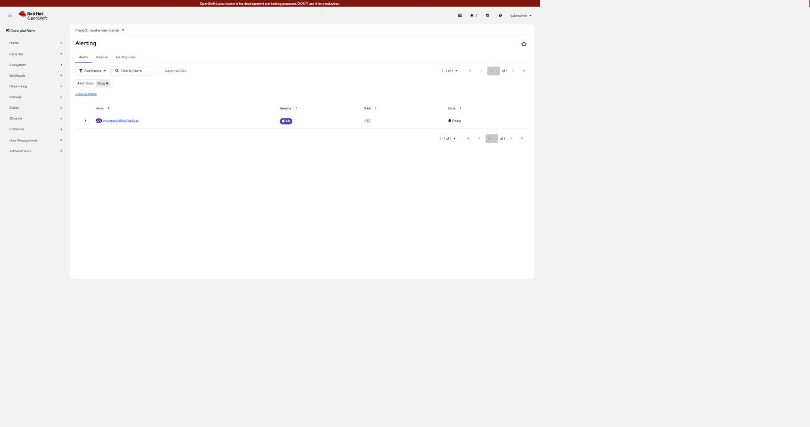

# Lab 02 — autoscaling on request rate, not CPU

Red Hat's **Custom Metrics Autoscaler Operator** (KEDA, packaged and supported by
Red Hat) scales the backend on the metric lab 01 added.

CPU is the usual autoscaling signal. The measured case against it here is not
that CPU stays flat — it is that **CPU utilisation is a ratio against a number
somebody picked for scheduling**, so the same traffic reads as anything you like.

At 1,076 rps with the autoscaler already pinned at 10 replicas:

| Measured | Value |
|---|---|
| request rate | 1,076 rps |
| CPU used ÷ CPU **limit** (500m) | **7.7%** |
| CPU used ÷ CPU **request** (50m) | **77.4%** |

An HPA's `averageUtilization` is computed against the **request**, so this
workload reads 77.4% — just under a conventional 80% target, and it would barely
scale. Raise the request to match the limit, a change with nothing to do with
traffic, and the identical load reads 7.7% and the HPA never scales at all.

Request rate has no such freedom: 1,076 rps is 1,076 rps. That is the argument
for scaling on the metric the service reports itself.

KEDA does not replace the HPA — it *feeds* one. `oc get hpa` shows a perfectly
ordinary HorizontalPodAutoscaler; KEDA only supplies the external metric.

## Install

```bash
oc apply -f labs/02-autoscaling/10-operator.yaml
oc wait --for=jsonpath='{.status.phase}'=Succeeded \
  csv/custom-metrics-autoscaler.v2.19.0-4 -n openshift-keda --timeout=600s
oc apply -f labs/02-autoscaling/20-keda-controller.yaml   # usually a no-op, see below
oc apply -f labs/02-autoscaling/30-scaledobject.yaml
```

The operator creates a `KedaController` named `keda` on install, so
`20-keda-controller.yaml` is normally a no-op. It is kept so the lab is
reproducible where that default is absent.

## The two RBAC grants that are easy to get wrong

Both produce the same unhelpful symptom — the `ScaledObject` never goes `Ready`
and the HPA target sits at `<unknown>`. Both were found by reading the
operator's own log rather than guessing.

**1. The operator mints the token, so the operator needs the permission.**

```text
serviceaccounts "keda-metrics-reader" is forbidden: User
"system:serviceaccount:openshift-keda:keda-operator" cannot create resource
"serviceaccounts/token" in the namespace "modernize-demo"
```

`boundServiceAccountToken` has KEDA mint a short-lived token — no long-lived
Secret is created or committed — but the minting is done by `keda-operator`, in
*your* namespace. Hence the `Role`/`RoleBinding` granting `create` on
`serviceaccounts/token`, restricted by `resourceNames` to the one ServiceAccount.

**2. The Thanos tenancy port checks `metrics.k8s.io`, not core `pods`.**

```text
prometheus query api returned error. status: 403
Forbidden (user=system:serviceaccount:modernize-demo:keda-metrics-reader,
           verb=get, resource=pods, subresource=)
```

`cluster-monitoring-view` is not sufficient on its own — it grants only
`get namespaces` and `prometheuses/api`. Granting core `""` pods does not help
either; neither does granting it cluster-wide. The policy the port enforces is
stored in the cluster and says exactly what it wants:

```bash
oc get secret thanos-querier-kube-rbac-proxy -n openshift-monitoring \
  -o jsonpath='{.data.config\.yaml}' | base64 -d
```
```yaml
"authorization":
  "resourceAttributes":
    "apiGroup": "metrics.k8s.io"      # <- NOT the core group
    "resource": "pods"
    "namespace": "{{ .Value }}"       # <- from the ?namespace= parameter
```

So the grant is `get pods` **in the `metrics.k8s.io` API group**. Reading that
secret is faster than any amount of trial and error.

### The two grants, in full

Both live in `30-scaledobject.yaml`; reproduced here so they can be copied
without opening the file.

**Grant 1 — let the KEDA operator mint the token.** `boundServiceAccountToken`
means the *operator* creates the token, in *your* namespace, so the operator's
ServiceAccount needs the permission. `resourceNames` keeps it to the one
ServiceAccount rather than every account in the namespace.

```yaml
apiVersion: rbac.authorization.k8s.io/v1
kind: Role
metadata:
  name: keda-token-minter
  namespace: modernize-demo
rules:
- apiGroups: [""]
  resources: ["serviceaccounts/token"]
  resourceNames: ["keda-metrics-reader"]
  verbs: ["create"]
---
apiVersion: rbac.authorization.k8s.io/v1
kind: RoleBinding
metadata:
  name: keda-token-minter
  namespace: modernize-demo
roleRef:
  apiGroup: rbac.authorization.k8s.io
  kind: Role
  name: keda-token-minter
subjects:
- kind: ServiceAccount
  name: keda-operator            # the OPERATOR, not the scaler's account
  namespace: openshift-keda
```

**Grant 2 — let the scaler through the Thanos tenancy port.** Note the API
group: `metrics.k8s.io`, not `""`.

```yaml
apiVersion: rbac.authorization.k8s.io/v1
kind: Role
metadata:
  name: keda-tenancy-read
  namespace: modernize-demo
rules:
- apiGroups: ["metrics.k8s.io"]   # NOT the core group - this is the whole trick
  resources: ["pods"]
  verbs: ["get"]
---
apiVersion: rbac.authorization.k8s.io/v1
kind: RoleBinding
metadata:
  name: keda-tenancy-read
  namespace: modernize-demo
roleRef:
  apiGroup: rbac.authorization.k8s.io
  kind: Role
  name: keda-tenancy-read
subjects:
- kind: ServiceAccount
  name: keda-metrics-reader      # the account the scaler authenticates AS
  namespace: modernize-demo
```

### The commands

```bash
# the ServiceAccount the scaler authenticates as
oc create sa keda-metrics-reader -n modernize-demo

# both Roles and RoleBindings (they ship inside this file)
oc apply -f labs/02-autoscaling/30-scaledobject.yaml
```

`cluster-monitoring-view` is **not** required once Grant 2 is in place — the
tenancy port checks `metrics.k8s.io/pods`, nothing else. If you prefer the
cluster-wide Thanos port (9091) instead of the tenancy port (9092), you need the
opposite: `cluster-monitoring-view` and no `metrics.k8s.io` grant.

```bash
# only if you switch serverAddress to port 9091
oc adm policy add-cluster-role-to-user cluster-monitoring-view \
  -z keda-metrics-reader -n modernize-demo
```

### Check the grants took, before blaming KEDA

```bash
SA=system:serviceaccount:modernize-demo:keda-metrics-reader
OP=system:serviceaccount:openshift-keda:keda-operator

# Grant 2 - note the API group on the resource
oc auth can-i get pods.metrics.k8s.io -n modernize-demo --as="$SA"      # yes
oc auth can-i get pods                -n modernize-demo --as="$SA"      # no, and that is correct

# Grant 1 - the resource MUST be named, see below
oc auth can-i create serviceaccounts/keda-metrics-reader \
  --subresource=token -n modernize-demo --as="$OP"                      # yes
```

**A `can-i` that says "no" here can be lying.** `keda-token-minter` is scoped
with `resourceNames`, and `can-i` without a resource name asks "may you do this
to *any* serviceaccount?" — the honest answer to which is no:

```bash
oc auth can-i create serviceaccounts/token -n modernize-demo --as="$OP"
# no   <- a FALSE NEGATIVE against a resourceNames-scoped Role
```

Name the resource and pass the subresource separately, as in the working form
above. Measured on a cluster where the ScaledObject was `Ready=True` the whole
time, so the permission was demonstrably present.

And end to end — mint a token and call Thanos the way the scaler does. A `200`
here means the RBAC is right and any remaining fault is in the ScaledObject:

```bash
TOK=$(oc create token keda-metrics-reader -n modernize-demo --duration=10m)
oc exec -n modernize-demo deploy/kiosk -- python3 -c "
import urllib.request, urllib.parse, ssl
ctx = ssl.create_default_context(); ctx.check_hostname = False; ctx.verify_mode = ssl.CERT_NONE
url = 'https://thanos-querier.openshift-monitoring.svc.cluster.local:9092/api/v1/query?' + \
      urllib.parse.urlencode({'query': 'sum(rate(inventory_rpc_total[1m]))',
                              'namespace': 'modernize-demo'})
r = urllib.request.Request(url); r.add_header('Authorization', 'Bearer $TOK')
print(urllib.request.urlopen(r, timeout=15, context=ctx).read().decode()[:160])
"
```

Verified output on a working cluster:

```json
{"status":"success","data":{"resultType":"vector","result":[{"metric":{},"value":[1790278102,"1249.11"]}]}}
```

## The trigger

```yaml
triggers:
- type: prometheus
  metricType: AverageValue        # threshold is PER POD
  metadata:
    serverAddress: https://thanos-querier.openshift-monitoring.svc.cluster.local:9092
    namespace: modernize-demo
    query: sum(rate(inventory_rpc_total{namespace="modernize-demo"}[1m]))
    threshold: "80"               # 80 rps per pod
```

`AverageValue` makes the arithmetic legible: total rps ÷ 80 = wanted replicas,
clamped to `minReplicaCount: 3` … `maxReplicaCount: 10`.

Port **9092** is the tenancy port and scopes every query to one namespace, which
is what a non-admin ServiceAccount should use. Port 9091 is cluster-wide and
needs only `cluster-monitoring-view` — simpler, but it can read every namespace.

## Measured

Load: 24 workers against the kiosk Route.

```text
time      metric(avg/pod)  target  desired  current  ready
14:28:51  202308m          80      9        6        6
14:28:53  130682m          80      10       9        6
14:29:30  101467m          80      10       10       10
```

`202308m` is milli-units: **202.3 rps per pod** against a target of 80, so the
HPA asked for more. It settled at the ceiling:

```console
$ oc get hpa keda-hpa-inventory -n modernize-demo
NAME                 REFERENCE              TARGETS            MINPODS   MAXPODS   REPLICAS
keda-hpa-inventory   Deployment/inventory   101467m/80 (avg)   3         10        10
```



`kube_horizontalpodautoscaler_status_current_replicas` against the configured
min and max. The staircase is the policy doing its job: a fast climb to the
ceiling of 10, then the deliberate one-pod-per-60s descent once load stopped,
then back up when it resumed.



Managed by the `inventory` ScaledObject, driving an ordinary HPA: current 10,
desired 10, metric `s0-prometheus` against target 80.



Fourteen pods in the namespace: 2 Envoy, **10 inventory**, 1 MongoDB, 1 kiosk.

### The alert that goes with it

`InventoryAtMaxReplicas` from `manifests/60-alerts.yaml` fired on its own during
this run — the autoscaler had genuinely been at its ceiling for ten minutes:



That is the point of the rule. Being pinned at `maxReplicaCount` is not a fault
to page someone about at 3am — it is the signal that the ceiling, not the
traffic, is now deciding your capacity. Hence `severity: info` and `for: 10m`.

Scaling out works because the backends are stateless — the catalogue is in
MongoDB, so a pod that started 25 seconds ago serves the same data as one that
has been up for an hour.

## Behaviour tuning

```yaml
scaleUp:
  stabilizationWindowSeconds: 0      # react within one polling interval
  policies: [{ type: Pods, value: 3, periodSeconds: 15 }]
scaleDown:
  stabilizationWindowSeconds: 120    # slow, so a brief dip keeps warm pods
  policies: [{ type: Pods, value: 1, periodSeconds: 60 }]
```

Scale up fast and scale down slowly. The defaults are the other way round for
good reason in production; this lab wants visible movement.

## Clean up

```bash
oc delete -f labs/02-autoscaling/30-scaledobject.yaml
oc delete -f labs/02-autoscaling/10-operator.yaml
```
