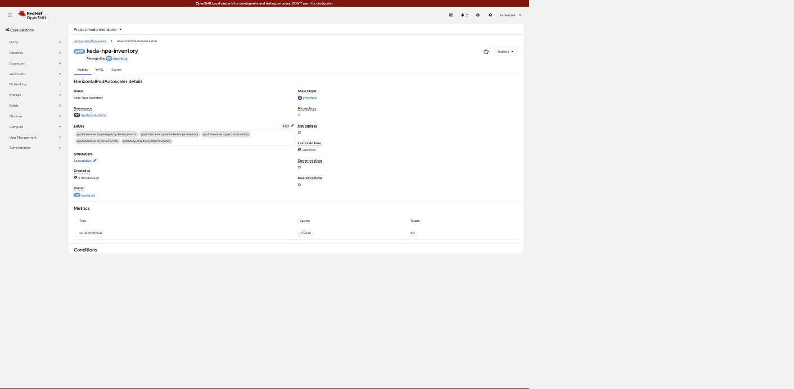
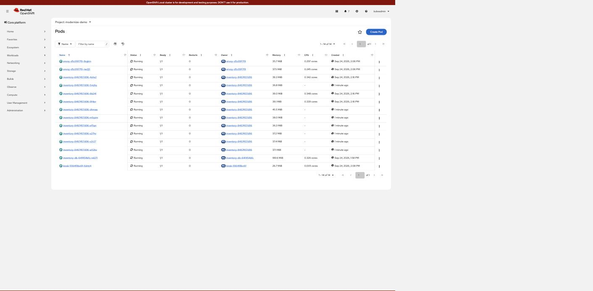

# Lab 02 — autoscaling on request rate, not CPU

Red Hat's **Custom Metrics Autoscaler Operator** (KEDA, packaged and supported by
Red Hat) scales the backend on the metric lab 01 added.

CPU is the usual autoscaling signal and it is the wrong one for this service: it
spends most of a request waiting on MongoDB, so CPU stays low while latency
climbs. The honest signal is the request rate the service reports itself.

KEDA does not replace the HPA — it *feeds* one. `oc get hpa` shows a perfectly
ordinary HorizontalPodAutoscaler; KEDA only supplies the external metric.

## Install

```bash
oc apply -f labs/02-autoscaling/10-operator.yaml
oc wait --for=jsonpath='{.status.phase}'=Succeeded \
  csv/custom-metrics-autoscaler.v2.19.0-4 -n openshift-keda --timeout=600s
oc apply -f labs/02-autoscaling/20-keda-controller.yaml   # usually a no-op, see below
oc apply -f labs/02-autoscaling/30-scaledobject.yaml
```

The operator creates a `KedaController` named `keda` on install, so
`20-keda-controller.yaml` is normally a no-op. It is kept so the lab is
reproducible where that default is absent.

## The two RBAC grants that are easy to get wrong

Both produce the same unhelpful symptom — the `ScaledObject` never goes `Ready`
and the HPA target sits at `<unknown>`. Both were found by reading the
operator's own log rather than guessing.

**1. The operator mints the token, so the operator needs the permission.**

```text
serviceaccounts "keda-metrics-reader" is forbidden: User
"system:serviceaccount:openshift-keda:keda-operator" cannot create resource
"serviceaccounts/token" in the namespace "modernize-demo"
```

`boundServiceAccountToken` has KEDA mint a short-lived token — no long-lived
Secret is created or committed — but the minting is done by `keda-operator`, in
*your* namespace. Hence the `Role`/`RoleBinding` granting `create` on
`serviceaccounts/token`, restricted by `resourceNames` to the one ServiceAccount.

**2. The Thanos tenancy port checks `metrics.k8s.io`, not core `pods`.**

```text
prometheus query api returned error. status: 403
Forbidden (user=system:serviceaccount:modernize-demo:keda-metrics-reader,
           verb=get, resource=pods, subresource=)
```

`cluster-monitoring-view` is not sufficient on its own — it grants only
`get namespaces` and `prometheuses/api`. Granting core `""` pods does not help
either; neither does granting it cluster-wide. The policy the port enforces is
stored in the cluster and says exactly what it wants:

```bash
oc get secret thanos-querier-kube-rbac-proxy -n openshift-monitoring \
  -o jsonpath='{.data.config\.yaml}' | base64 -d
```
```yaml
"authorization":
  "resourceAttributes":
    "apiGroup": "metrics.k8s.io"      # <- NOT the core group
    "resource": "pods"
    "namespace": "{{ .Value }}"       # <- from the ?namespace= parameter
```

So the grant is `get pods` **in the `metrics.k8s.io` API group**. Reading that
secret is faster than any amount of trial and error.

## The trigger

```yaml
triggers:
- type: prometheus
  metricType: AverageValue        # threshold is PER POD
  metadata:
    serverAddress: https://thanos-querier.openshift-monitoring.svc.cluster.local:9092
    namespace: modernize-demo
    query: sum(rate(inventory_rpc_total{namespace="modernize-demo"}[1m]))
    threshold: "80"               # 80 rps per pod
```

`AverageValue` makes the arithmetic legible: total rps ÷ 80 = wanted replicas,
clamped to `minReplicaCount: 3` … `maxReplicaCount: 10`.

Port **9092** is the tenancy port and scopes every query to one namespace, which
is what a non-admin ServiceAccount should use. Port 9091 is cluster-wide and
needs only `cluster-monitoring-view` — simpler, but it can read every namespace.

## Measured

Load: 24 workers against the kiosk Route.

```text
time      metric(avg/pod)  target  desired  current  ready
14:28:51  202308m          80      9        6        6
14:28:53  130682m          80      10       9        6
14:29:30  101467m          80      10       10       10
```

`202308m` is milli-units: **202.3 rps per pod** against a target of 80, so the
HPA asked for more. It settled at the ceiling:

```console
$ oc get hpa keda-hpa-inventory -n modernize-demo
NAME                 REFERENCE              TARGETS            MINPODS   MAXPODS   REPLICAS
keda-hpa-inventory   Deployment/inventory   101467m/80 (avg)   3         10        10
```



Managed by the `inventory` ScaledObject, driving an ordinary HPA: current 10,
desired 10, metric `s0-prometheus` against target 80.



Fourteen pods in the namespace: 2 Envoy, **10 inventory**, 1 MongoDB, 1 kiosk.

Scaling out works because the backends are stateless — the catalogue is in
MongoDB, so a pod that started 25 seconds ago serves the same data as one that
has been up for an hour.

## Behaviour tuning

```yaml
scaleUp:
  stabilizationWindowSeconds: 0      # react within one polling interval
  policies: [{ type: Pods, value: 3, periodSeconds: 15 }]
scaleDown:
  stabilizationWindowSeconds: 120    # slow, so a brief dip keeps warm pods
  policies: [{ type: Pods, value: 1, periodSeconds: 60 }]
```

Scale up fast and scale down slowly. The defaults are the other way round for
good reason in production; this lab wants visible movement.

## Clean up

```bash
oc delete -f labs/02-autoscaling/30-scaledobject.yaml
oc delete -f labs/02-autoscaling/10-operator.yaml
```
